```{r child = "../setup.Rmd"}
```

```{r set-theme, include=FALSE}
library(xaringanthemer)
style_duo_accent(
  primary_color      = "#0F4C81", # pantone classic blue
  secondary_color    = "#B6CADA", # pantone baby blue
  header_font_google = google_font("Raleway"),
  text_font_google   = google_font("Raleway", "300", "300i"),
  code_font_google   = google_font("Source Code Pro"),
  text_font_size     = "30px"
)
```


```{r load-packages, message=FALSE, echo=FALSE}
library(tidyverse)
library(broom)
library(scales)
library(openintro)
library(jsonlite)
```

## Activity 

.hand[while we wait to get started...]

- Go to [bit.ly/teach-r-online-cloud](https://bit.ly/teach-r-online-cloud)
- Log in with Google or GitHub, or create a new account
- Once you join our workspace, start the assignment titled `COVID-19`
- Knit the document titled `covid-19.Rmd` and inspect the visualisation
- Then, in the R Markdown document, change one of the countries plotted to a country of your own choice
- Knit again, and inspect

---

class: middle

.pull-left[
  .huge-text[Why]
]
.pull-right[
  .larger[
  RStudio  
  in the cloud?
  ]
]

---

.pull-left[
### lots of friction points

- Install R
- Install RStudio
- Install the following packages:
  - rmarkdown
  - tidyverse 
  - ...
- Load these packages
- Install git
]
--
.pull-right[
### much less friction

- Go to rstudio.cloud
- Log in

```{r hello-r, eval=FALSE}
>hello R!
```
]

---

.pull-left[
### you used to have this
```{r computer-lab, echo=FALSE, out.width="70%"}
knitr::include_graphics("img/jonathan-borba-PZBjJ12Xv2s-unsplash.jpg")
```
]
--
.pull-right[
### and now you have this
```{r laptop-at-home, echo=FALSE, out.width="80%"}

```
]

.footnote[
.tiny[Photos by Jonathan Borba and Sincerely Media on Unsplash.]
]

---

class: middle

.pull-left[
  .huge-text[How]
]
.pull-right[
  .larger[
  RStudio  
  in the cloud?
  ]
]

---

.pull-left[
**RStudio Server Pro** __*__  

You have...
- sysadmin experience / IT support
- hardware / local VM / cloud computing credit
- RStudio experience

.midi[See [RStudio Academic Pricing](https://rstudio.com/pricing/academic-pricing/), freely licensed for teaching purposes.]
]
.pull-right[
**RStudio Cloud**

You have...
- RStudio experience
]
  
.footnote[
.small[
__*__ Çetinkaya-Rundel, Mine, and Rundel, Colin. "Infrastructure and tools for teaching computing throughout the statistical curriculum." The American Statistician (2018). Part of the Practical Data Science for Stats collection. [[Peer J]](https://peerj.com/preprints/3181/) [[TAS]](https://doi.org/10.1080/00031305.2017.1397549)
]
]

---

class: middle

.pull-left[
  .huge-text[Hello]
]
.pull-right[
  .larger[
  RStudio  
  Cloud
  ]
]

---

## What is RStudio Cloud?

<br>

.pull-left-narrow[
```{r echo=FALSE}

```
]
.pull-right-wide[
.large[We created [**RStudio Cloud**](https://rstudio.cloud/) to make it easy for professionals, hobbyists, trainers, teachers, and students to do, share, teach, and learn data science using R.]
]

---

.center[
```{r echo=FALSE, out.width="80%"}
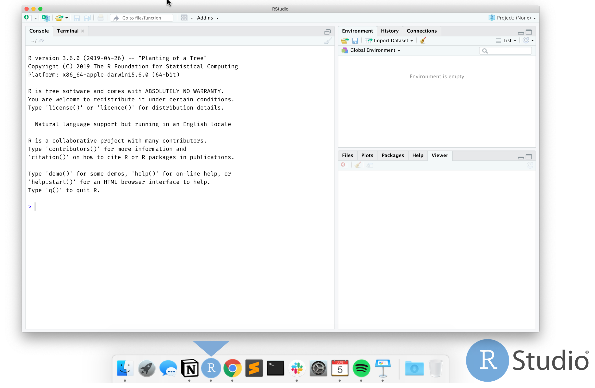
```
]

---

.center[
```{r echo=FALSE, out.width="80%"}
knitr::include_graphics("img/rstudio-cloud.png")
```
]

---

## Why RStudio Cloud?

- Does not require IT support

--
- Git works out of the box
- Knit to PDF and Word works out of the box

--
- Features designed for instructors

---

## Contexts

- Shorter workshops: Likely no opportunity to communicate pre-workshop instructions, varied computing background and learning goals

- Semester long courses
  - Intro data science / statistics: little to no background in stats, data science, programming
  - Upper level data science / statistics: Varied computing background and different computer setups

---

## RStudio Cloud: First look

```{r echo=FALSE, out.width="80%", fig.align="center"}
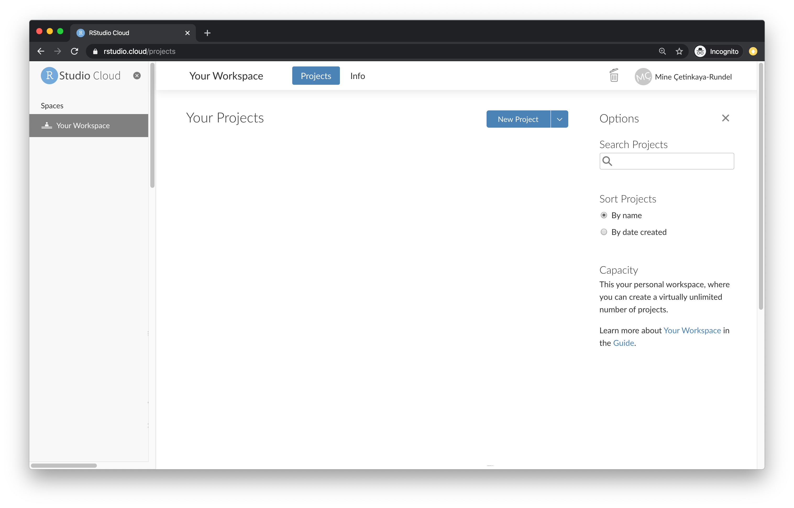
```

---

## Workspaces

- When you create an account on RStudio Cloud you get a workspace of your own

- You can add a new workspace and control its permissions

- Projects in either workspace can be public or private

---

## A framework for workspaces

```{r echo=FALSE, out.width="90%", fig.align="center"}
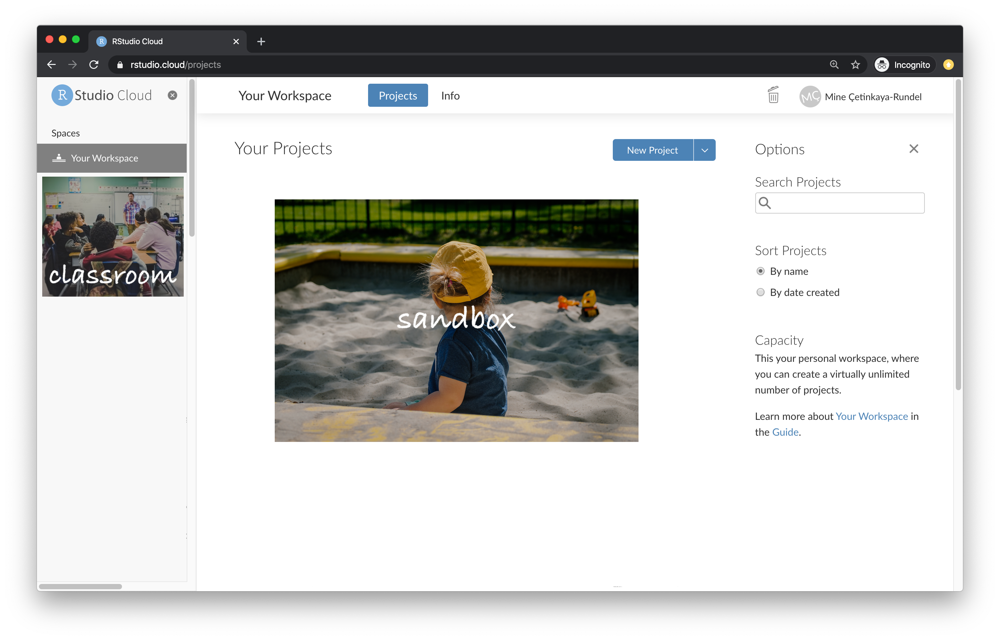
```

---

## Projects

.pull-left[
A new project in RStudio Cloud
```{r echo=FALSE, out.width="90%", fig.align="center"}
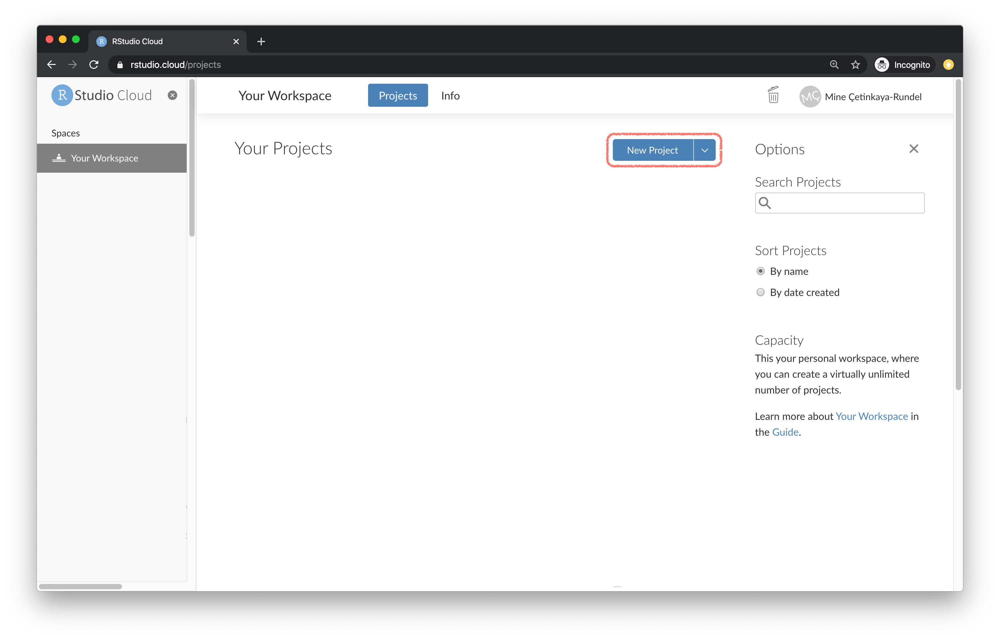
```
]
.pull-right[
is a new project in RStudio IDE
```{r echo=FALSE, out.width="90%", fig.align="center"}
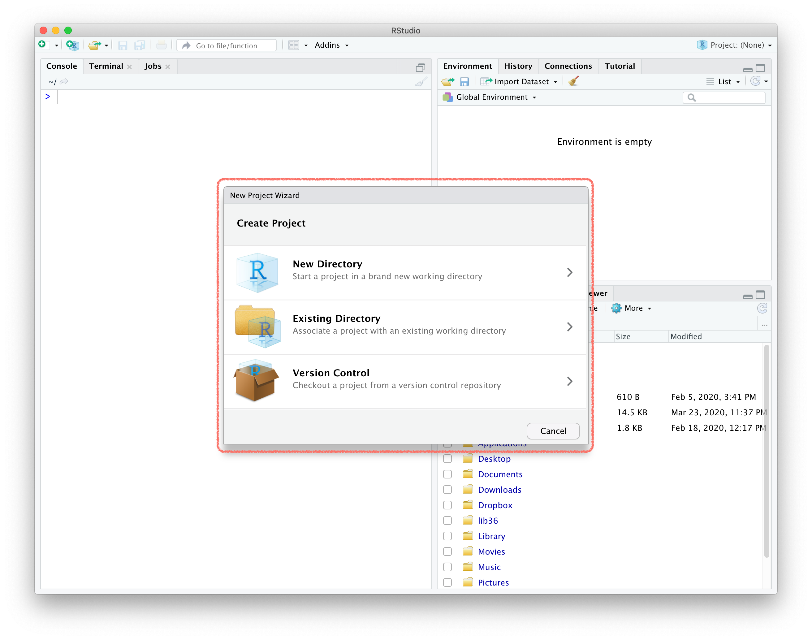
```
]

.alert[
**PSA:** If you use RStudio, use projects! Trust me, you won’t regret it. Find out more on [R for Data Science](https://r4ds.had.co.nz/workflow-projects.html).
]

---

## Projects from Git

.pull-left[
A new project from Git repo in RStudio Cloud
```{r echo=FALSE, out.width="90%", fig.align="center"}
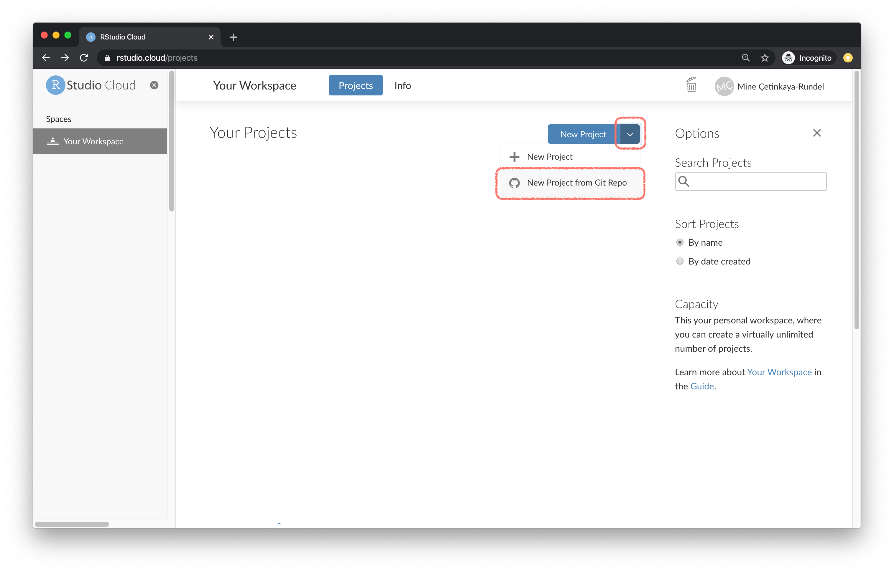
```
]
.pull-right[
is the same as a new project from Git in RStudio IDE
```{r echo=FALSE, out.width="90%", fig.align="center"}
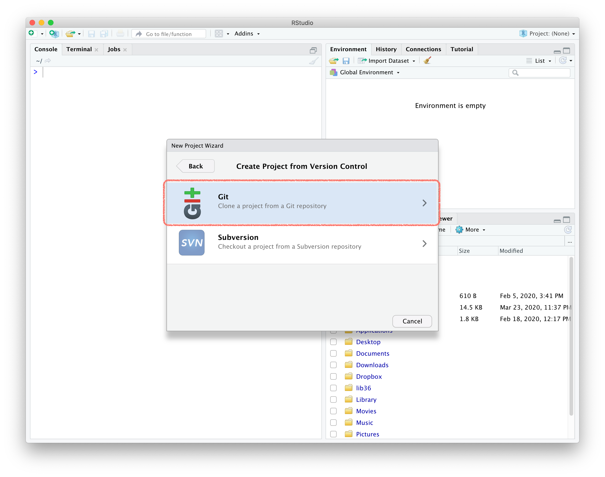
```
]

Both options `clone` a Git repo

---

## Sharing options

- Option 1: Share a single project

- Option 2: Invite users to a workspace (presumably with many projects)

---

class: middle

# Sharing option

.pull-left[
  .huge-number[1]
]
.pull-right[
  .larger[
  Single  
  project
  ]
]

---

class: middle

.center[
```{r echo=FALSE, fig.align="center", out.width="80%"}
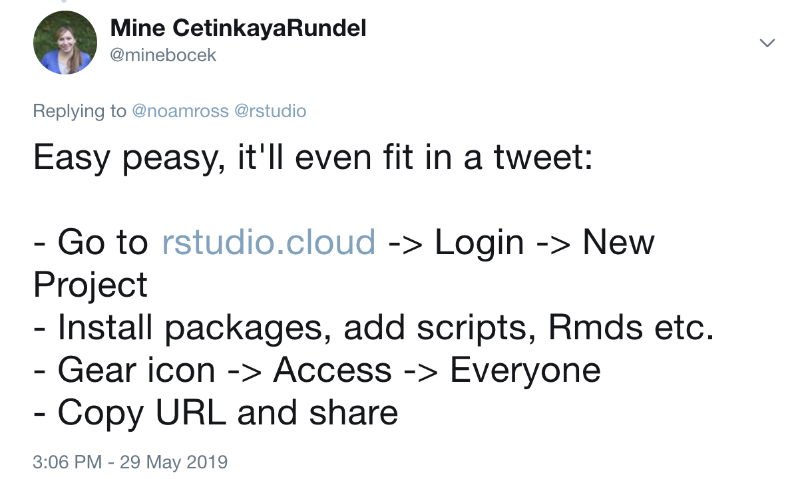
```
]

---

class: middle

.center[
.larger[
`r emo::ji("woman_teacher")` teacher
]
.larger[
`r emo::ji("woman_technologist")` student
]
]

---

## `r emo::ji("woman_teacher")` Creating and sharing a single project

.center[
<iframe width="896" height="504" src="https://www.youtube.com/embed/81MrMcKZTX8" frameborder="0" allow="accelerometer; autoplay; encrypted-media; gyroscope; picture-in-picture" allowfullscreen></iframe>
]

---

## `r emo::ji("woman_technologist")` Receiving and working on a shared project

.center[
<iframe width="896" height="504" src="https://www.youtube.com/embed/_VCYdDQTFG8" frameborder="0" allow="accelerometer; autoplay; encrypted-media; gyroscope; picture-in-picture" allowfullscreen></iframe>
]

---

.your-turn[

`r emo::ji("woman_teacher")`: Identify one person in the group as **instructor** (Tip: Choose someone *without* a second / large display)  
`r emo::ji("woman_technologist")`: Rest of the group are **students**

#### `r emo::ji("woman_teacher")` Instructor:
- Create a new project and give it a name
- Install a package of your choice
- Create a template R Markdown document in the project
- Change the access level of the project so others can see it as well
- Copy the project URL and share it with the rest of the group in the chat box

#### `r emo::ji("woman_technologist")` Students: 
Access your instructor's project and pick up where they left off
]

```{r echo=FALSE}
countdown(minutes = 10, warn_when = 1)
```

---

## Pros / cons: Sharing a single project

.pull-left[
### Good!

- Students land directly in a project upon login
- Works well for workshops where all work will be completed in a single project
- Also great for sharing code in general, e.g. collaboration, reprexes, etc.
]
--
.pull-right[
### Not so good...

- Students need to remember to make a copy of the project (which means you need to remember to remind them!)
- You can't keep track which students started their assignment
- Students control permissions
- You can't easily peek into student projects -- they would need to explicitly share the project with you
]

---

class: middle

# Sharing option

.pull-left[
  .huge-number[2]
]
.pull-right[
  .larger[
  Work-    
  space
  ]
]

---

## `r emo::ji("woman_teacher")` Creating a workspace

.center[
<iframe width="896" height="504" src="https://www.youtube.com/embed/tqu1m9R1HLw" frameborder="0" allow="accelerometer; autoplay; encrypted-media; gyroscope; picture-in-picture" allowfullscreen></iframe>
]

---

## `r emo::ji("woman_teacher")` Workspace membership

```{r echo=FALSE, fig.align="center", out.width="70%"}
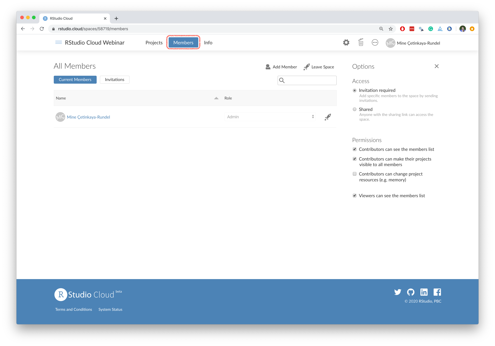
```

---

## `r emo::ji("woman_teacher")` Role permissions

<br>

| role        | permission                                       | course role |
|-------------|--------------------------------------------------|-------------|
| admin       | manage users, view, edit and manage all projects | instructor  |
| moderator   | view, edit and manage all projects               | TA          |
| contributor | create, edit and manage their own projects       | student     |
| viewer      | view projects shared with everyone               | auditor     |

---

## `r emo::ji("woman_teacher")` Other permissions

<br>

#### Under the Members tab:

.pull-left-narrow[
```{r echo=FALSE, out.width="100%"}
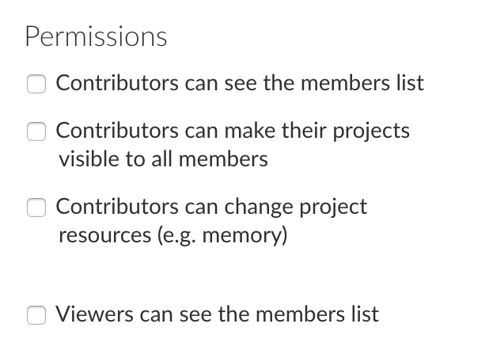
```
]
.pull-right-wide[
- By default, all permissions are turned off
- Think carefully before checking these boxes
]

---

## `r emo::ji("woman_teacher")` Options

<br>

#### Under the Members tab:

.pull-left-narrow[
```{r echo=FALSE, out.width="100%"}
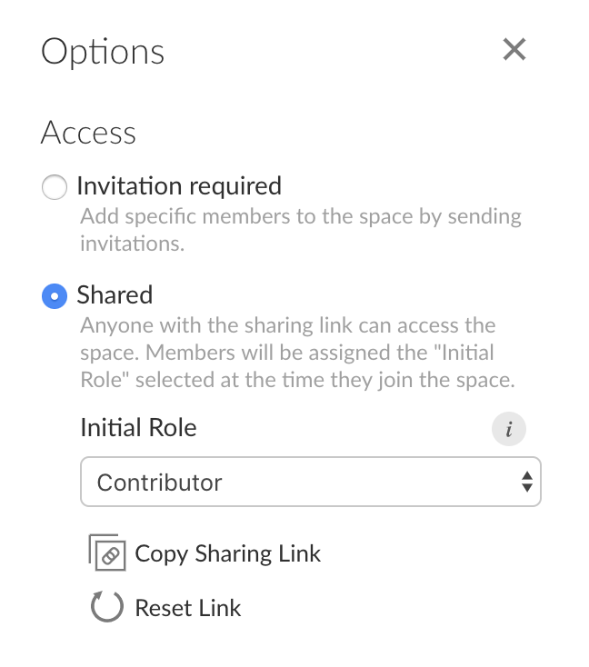
```
]
.pull-right-wide[
- Make workspace shared for a short period of time, share link with students, enrol them as contributors.
- After initial round of enrolment (e.g. drop/add) switch over to this access level
- Use invitations for visitors added mid-semester
]

---

## `r emo::ji("woman_teacher")` Inviting a student to a workspace

.center[
```{r echo=FALSE, out.width="70%", fig.align="center"}
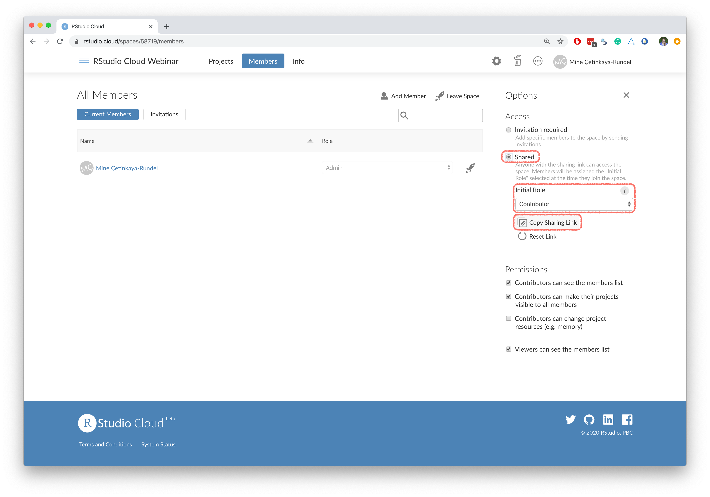
```
]

---

## Base projects

One of the most attractive features of RStudio Cloud!

- Packages you want *installed* on all student projects

--
- Text documents you want to appear on **all** student projects (e.g. code of conduct, turn-in instructions, etc.)

--
- Applies to all projects created **after** base project has been specified, doesn't apply retroactively

--
- Can be updated as many times as you like throughout the course (without having to convince your IT!!!)

---

## `r emo::ji("woman_teacher")` Setting up your base project

.center[
<iframe width="896" height="504" src="https://www.youtube.com/embed/Fz9UR6uxAG4" frameborder="0" allow="accelerometer; autoplay; encrypted-media; gyroscope; picture-in-picture" allowfullscreen></iframe>
]

---

.your-turn[

#### `r emo::ji("woman_teacher")` Instructor:

- Create a new workspace, give it a name, and add a short description
- Change the settings of your workspace to Shared
- Change the permissions of your workspace how you like
- Add a base project to your workspace:
  - Create a new project
  - Install one or two of your favourite packages
  - Start an R Markdown document so necessary packages get installed
  - Add a code-of-conduct.md or some other plain text document
  - Make this project visible to everyone
  - In the settings menu for the workspace, set it as base project
- Create a new assignment: `Homework 01`.
- Grab the sharing link for your workspace and share with your group.

#### `r emo::ji("woman_technologist")` Students:
- Join your instructor's workspace and start the assignment.
]

```{r echo=FALSE}
countdown(minutes = 15)
```

---

## Git integration

`r emo::ji("stop_sign")` Only relevant if teaching with Git & GitHub!

--

`r emo::ji("grin")` Base project template can be used, so new project from Git also has the right packages installed!

*More on this in Workshop 3 on 17 July!*

---

## Pros / cons: Sharing a workspace

.pull-left[
### Good!

- Various permission levels
- Base projects with desired packages installed
- Assignments -- no more "make a copy of the project before starting work"
- Peek into students’ projects
```{r echo=FALSE, out.width="80%", fig.align="center"}
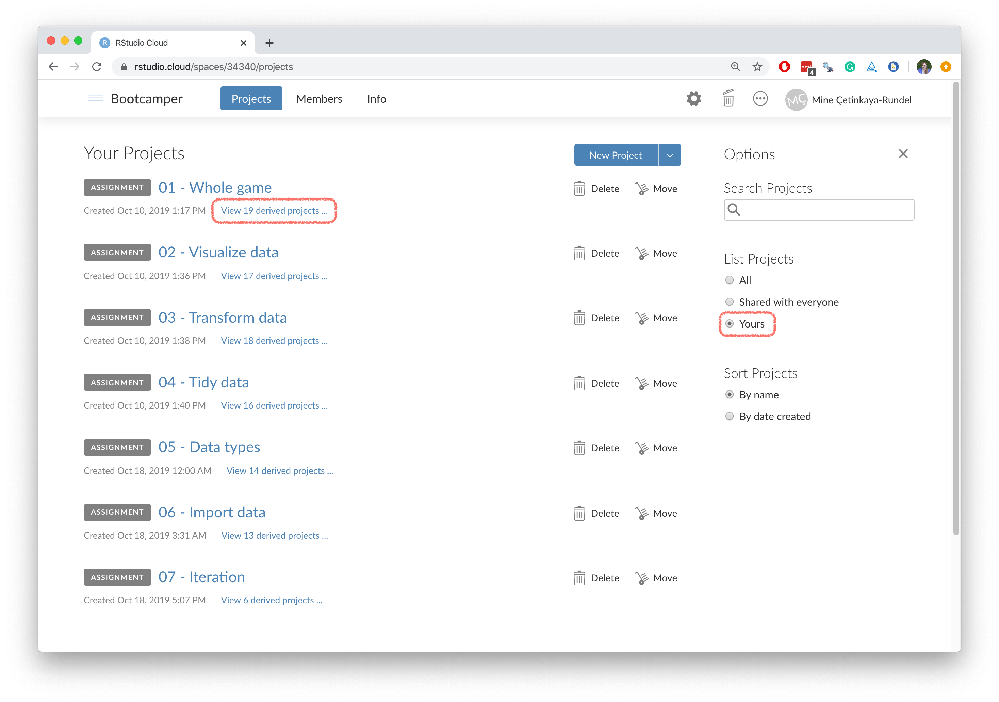
```
]
--
.pull-right[
### Not so good...

- Students land in the workspace, may need to provide instructions for the next steps
- Git config for each project can get tedious and doesn't reflect realistic practice
]

---

## Common pitfalls

- Changes you make after student launches a project under either model (single project or workspace) won’t propagate to their project


--
- Packages in the base project will be **installed** in all projects in the workspace, but not **loaded**
  - If you need students to run code in the Console that requires a package, your instructions should remind them to load the package first
  - If using Rmd document, add a `load-package` chunk on top

---

## Feedback / questions / troubleshooting

- Check out [status.rstudio.com](https://status.rstudio.com/)

- Post on [RStudio Community](https://community.rstudio.com/c/rstudio-cloud)

- Email [support@rstudio.cloud](mailto:support@rstudio.cloud)

```{r echo=FALSE, out.width="70%", fig.align="center"}
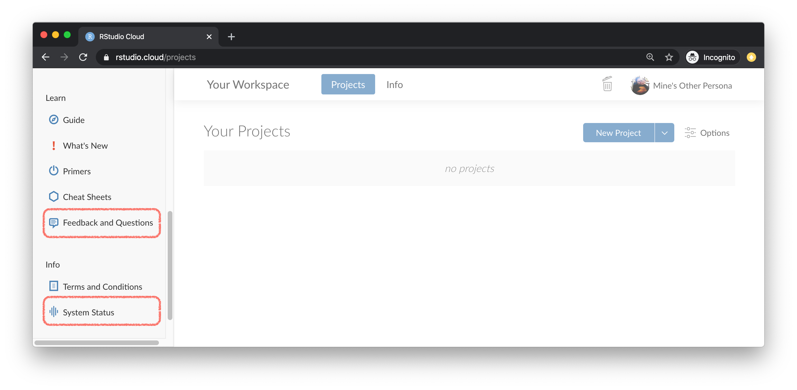
```

---

class: middle, inverse

# Parting remarks

---

## Tips

- Each project is allocated 1GB of RAM
  - Test things out before assignments involving large datasets 

- What your students see is not always what you see
  - Create a secondary account and add as a student

---

## More tips

Make brief screencasts for getting students oriented with the platform (especially if remote teaching), or use mine! 

.center[
[Navigating RStudio Cloud on YouTube](https://www.youtube.com/playlist?list=PLNUVZZ6hfXX05Bs80Hg5MjbOPnEFmwiOM)
]

```{r echo=FALSE, out.width="50%", fig.align="center"}
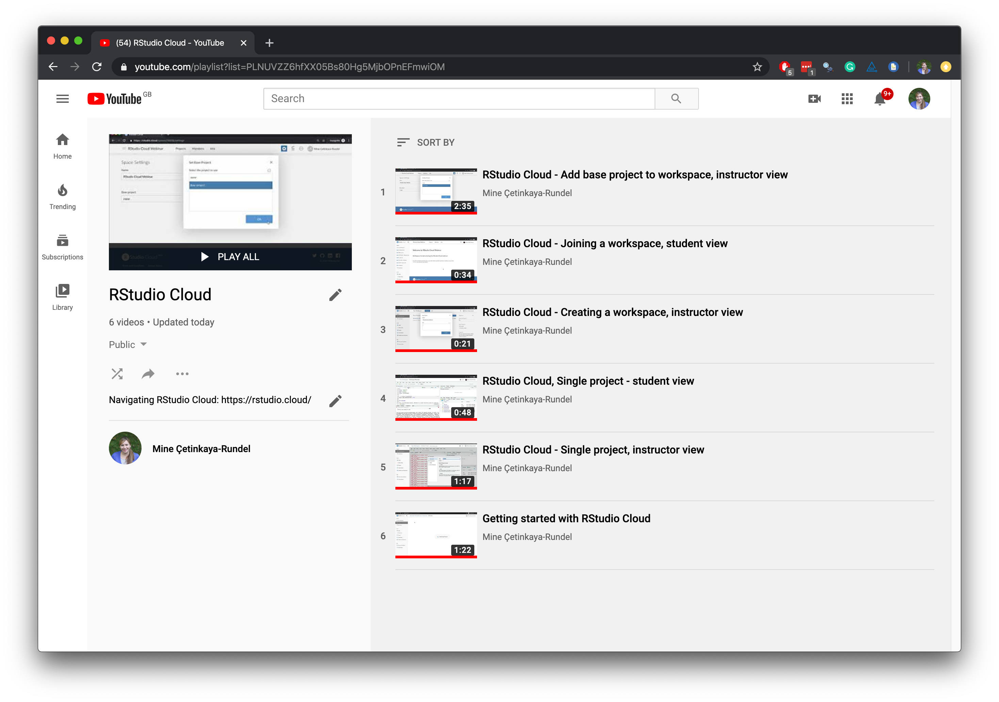
```

---

## More tips

Remind students how to hide the sidebar!

```{r echo=FALSE, out.width="70%", fig.align="center"}
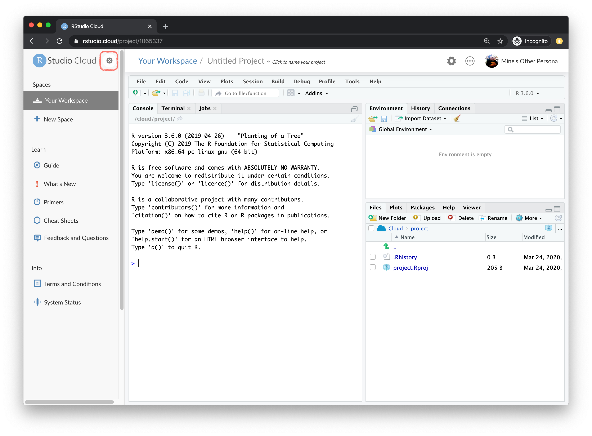
```
  
---

## More tips

- Read the [RStudio Cloud guide](https://rstudio.cloud/learn/guide)

```{r echo=FALSE, out.width="70%", fig.align="center"}
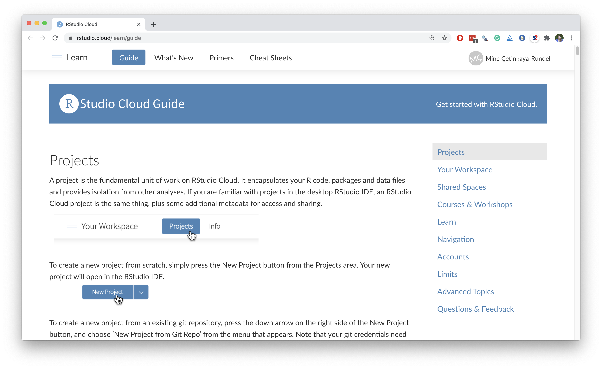
```
  
---

## `r emo::ji("parcel")` rscloud

- You can access RStudio Cloud's API to manage space members programatically using the **rscloud** package:

- You will need to create client credentials to use the package. You can create credentials at [login.rstudio.cloud/identity](https://login.rstudio.cloud/identity).

```{r eval=FALSE}
# install.packages("rscloud")
devtools::install_github("rstudio/rscloud")
```


---

## Primers: [rstudio.cloud/learn/primers](https://rstudio.cloud/learn/primers)

Free primers made with the **learnr** package, companion to [R4DS by Grolemund and Wickham](https://r4ds.had.co.nz/)

.center[
```{r echo=FALSE, out.width="70%"}
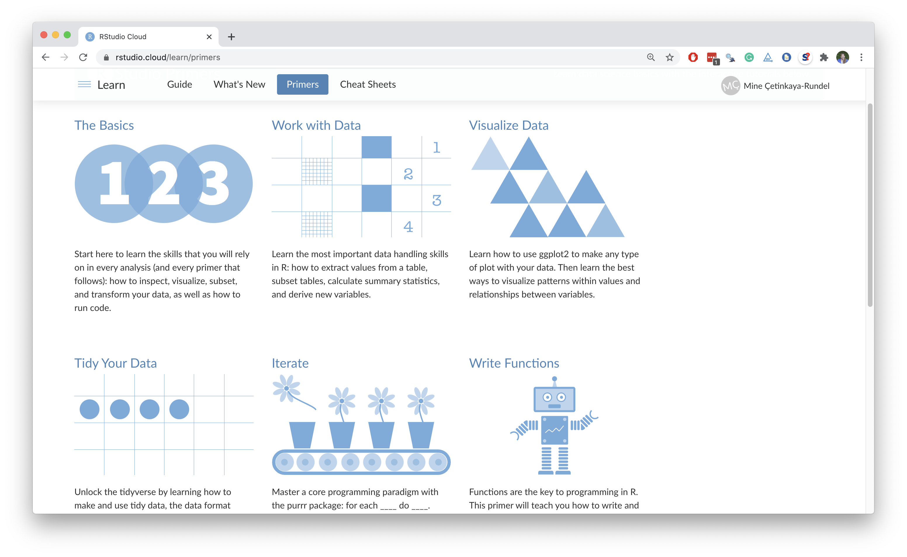
```
]

---

class: middle

## Pricing

```{r echo=FALSE, out.width="100%"}
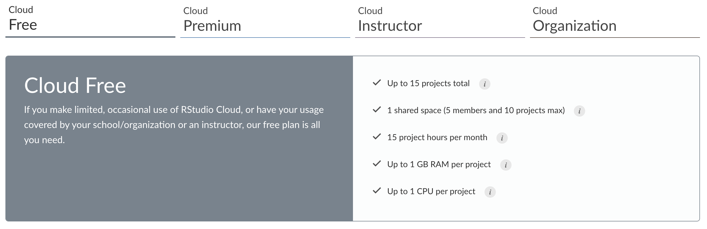
```

---

class: middle

## Pricing

```{r echo=FALSE, out.width="90%"}
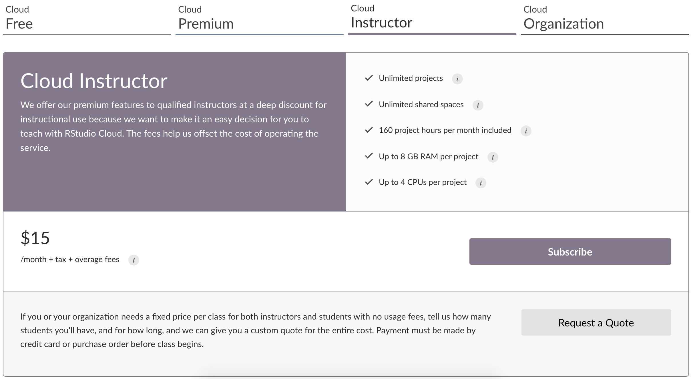
```

---

class: middle

## Pricing

```{r echo=FALSE, out.width="100%"}
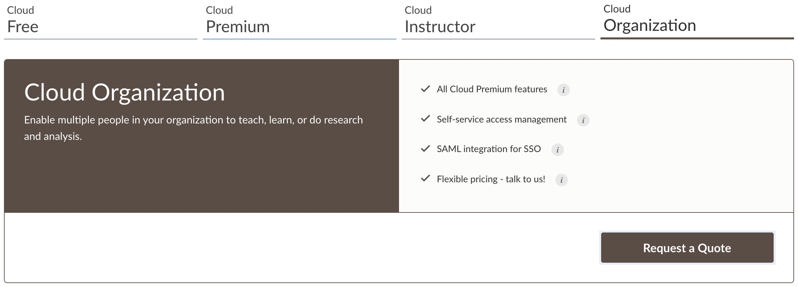
```

---

.hand-large[thank you!]

- All materials at [bit.ly/teach-r-online-mats](https://bit.ly/teach-r-online-mats)

- Sign up for the upcoming workshops at [bit.ly/teach-r-online](https://bit.ly/teach-r-online):
  - 10 July: Building interactive tutorials in R
  - 17 July: Teaching computing with Git and GitHub 
