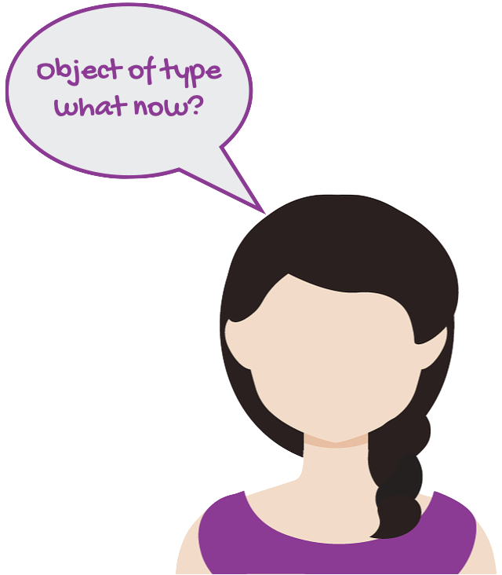
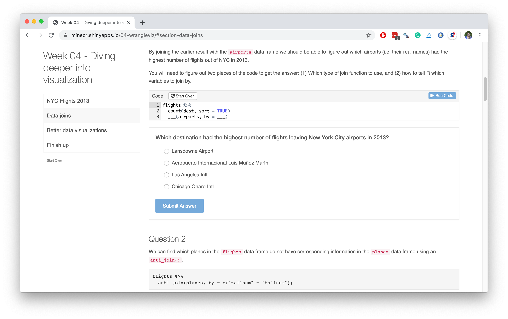
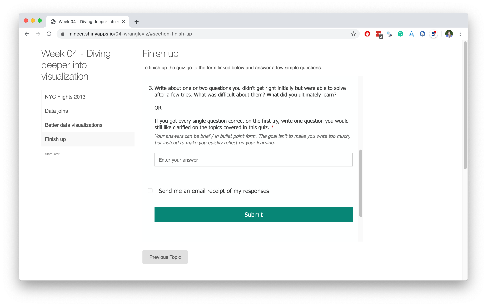
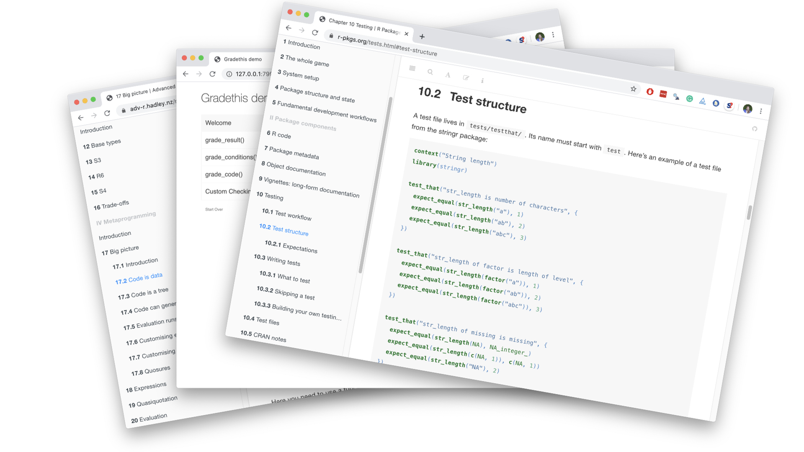

```{r child = "../setup.Rmd"}
```

```{r set-theme, include=FALSE}
library(xaringanthemer)
style_duo_accent(
  primary_color      = "#7A8387", # pantone monument
  secondary_color    = "#B6CADA", # pantone baby blue
  header_font_google = google_font("Raleway"),
  text_font_google   = google_font("Raleway", "300", "300i"),
  code_font_google   = google_font("Source Code Pro"),
  text_font_size     = "30px"
)
```


```{r load-packages, message=FALSE, echo=FALSE}
library(tidyverse)
library(broom)
library(scales)
library(openintro)
library(jsonlite)
```

## Activity 

**TO DO: UPDATE**

.hand[while we wait to get started...]

- Go to [INSERT LINK](INSERT LINK)
- Start working through the tutorial
- Feel free to make mistakes and test out the feedback
- If you get to the very end, follow the instructions (but if they seem a bit opaque, don't fret, we'll say more about "submission" later...)

---

.huge-text[you...]

.large[
- know and teach R
- are familiar with R Markdown
- are interested in providing automated feedback
- might be interested in automated marking
]

---

class: middle, inverse

.pull-left[
  .huge-text[why]
]
.pull-right[
  .larger[
  auto  
  feedback
  ]
]

---

class: middle

.pull-left[
.center[
.huge[`r emo::ji("point_right")`] <br>
.large[**Nudging**] <br>
students towards the right answer, especially in formative assessments
]
]

---

```{r include=FALSE}
set.seed(1234)
means <- rnorm(10) %>% round(2)
```

.sample-question[
Suppose 10 means from a simulated sampling distribution is stored in a vector called `means`.
```{r}
means
```
What is the value of the first mean?
]
--
<br>
.pull-left-wide[
.sample-answer[
```{r error=TRUE}
mean[1]
```
]
]
--
.pull-right-narrow[
```{r echo=FALSE, fig.align="right"}

```
]

---

## Nudging

.hand-blue[Not all feedback is useful, at least not for beginners...]

<br>

Providing helpful feedback can help them nudge them towards success:

```{r eval=FALSE}
mean[1]
```

```{r echo=FALSE}
ui_oops("`mean` is a function and a function doesn't have elements that can be subsetted with square brackets.")
ui_info("`means` is the vector of sample means calculated earlier.")
```

---

.sample-question[
Visualise the relationship between city and highway mileage of cars from the `mpg` dataset, conditional on year of manufacture.
]

--
<br>
.sample-answer[
There is a strong, positive, linear relationship between the city and highway mileage of cars. Year does not seem to be related to either variable.
```{r message=FALSE, fig.height=2.5, fig.width=9, dpi=300, out.width="70%"}
ggplot(mpg,aes(x = hwy, y = cty, fill=year)) +geom_point()+geom_smooth()
```
]

---

class: middle

.pull-left-wide[
.sample-feedback[
- You mention a linear relationship, however your plot uses a loess fit to visualise the relationship between city and highway mileage. Also, the plot displays the uncertainty around the fit, but you haven't addressed it in your narrative.
- Year should be mapped to the `color` aesthetic, not `fill`. 
- Plot styling: Use informative axis labels, noting units of measurement. Also, give an informative title to your plot.
- Code styling: Use consistent spacing around operators (e.g ` = `) and line breaks after `+` in each layer of your ggplot.
]
]
.pull-right-narrow[
```{r echo=FALSE, fig.align="center"}

```
]

---

class: middle

.pull-left[
.center[
.huge[`r emo::ji("point_right")`] <br>
.large[**Nudging**] <br>
students towards the right answer, especially in formative assessments
]
]
.pull-right[
.center[
.huge[`r emo::ji("heavy_plus_sign")`] <br>
.large[**Scaling**] <br>
up efficiency of grading faster than (human) resources
]
]

---

## Scaling

.hand-blue[Our courses are growing, and that's a good thing, right?]

--

- Students turning in their work as R Markdown documents makes collecting submissions including code and narrative straightforward.

--

- Providing feedback on both the code and narrative is not scalable unless (human) resources dedicated to your course grow proportionally with enrolments.

---

class: middle, inverse

.pull-left[
  .huge-text[how]
]
.pull-right[
  .larger[
  auto  
  feedback
  ]
]

---

## `r emo::ji("package")` learnr

- **learnr** is an R package that makes it easy to create interactive tutorials from R Markdown documents.

- Tutorials can include:
  - Narrative, figures, illustrations, and equations
  - Code exercises (R code chunks that users can edit and execute directly)
  - Multiple choice questions
  - Videos (YouTube, Vimeo)
  - Interactive Shiny components

- learnr is on CRAN

```{r eval=FALSE}
install.packages("learnr")
```
  
---

background-image: url(images/learnr-first-look.png)
background-position: center
background-repeat: no-repeat
background-size: contain
class: middle

---

## `r emo::ji("package")` gradethis

- Companion to the learnr package, **gradethis** provides multiple methods to grade learnr exercises:
  - `grade_code()`: Grade code against a solution
  - `grade_conditions()`: Grade all specified conditions
  - `grade_result()`: Grade result of exercise code

- gradethis is not yet on CRAN

```{r eval=FALSE}
devtools::install_github("rstudio/gradethis")
```

---

background-position: center
background-repeat: no-repeat
background-size: contain
class: middle

### Demo: learnr / gradethis

[**`[tutorial]`**](https://minecr.shinyapps.io/nobel-laureates-learnr) 

[**`[code]`**](https://github.com/mine-cetinkaya-rundel/feed-me-back/blob/master/examples/01-learnr-gradethis/nobel-laureates-learnr.Rmd)

---

class: middle, inverse

.huge-text[closing]
.huge-text[thoughts]

---

## Best practices for automated feedback

--

- Measure twice, cut once (verify the correctness of your tests) 📏📏 ✂️

--

- Use rounding & type coercion to write robust tests 💪

--

- Use hashing to hide solutions for visible tests 🕵️

--

- Test your tests on the students compute environment 💻

--

- Abstract your tests to a script that is sourced/imported into the students literate code document 📁

--

- Don't give automated feedback on everything 🙈

--

- Consider peer feedback where automated feedback is not feasible (e.g. interpretation, narrative) but scalability is an issue 👯

---

class: middle, inverse

.huge-text[faq]

---

.large[
.hand-blue[Q: What is an approachable way to get started?]
]

Build a tutorial where students build develop their analysis in exercise code 
chunks (that are not checked) and only multiple choice questions are used for 
assessment. [**`[example]`**](https://minecr.shinyapps.io/04-wrangleviz)

```{r echo=FALSE, out.width="85%", fig.align="center"}

```

---

.large[
.hand-blue[Q: Is it possible to record student data?]
]

Yes, though not trivial, at this point. See [recording events](https://rstudio.github.io/learnr/publishing.html#Recording_Events) section on the learnr documentation and the [**submitter**](https://github.com/dtkaplan/submitr) package by Danny Kaplan.

A solution that may be "good enough" for formative exercises: embed a 
Google/Microsoft/etc. Form at the end and ask students to "sign in" their work.
**Tip:** Add a free-text question to this form where students reflect on the 
exercises they just completed, and you can easily capture and analyze. [**`[example]`**](https://minecr.shinyapps.io/04-wrangleviz/#section-finish-up)

```{r echo=FALSE, out.width="60%", fig.align="center"}

```

---

.large[
.hand-blue[Q: I've built simple tutorials already. How do I make the jump to code checking and providing automated feedback that is actually useful?]
]

- Replicate `gradethis::gradethis_demo()`, then make incremental changes
- Read the [Testing](https://r-pkgs.org/tests.html#test-tests) chapter in R Packages (Wickham and Bryan) 
- Also read the [Metaprogramming](https://adv-r.hadley.nz/metaprogramming.html) section in Advanced R (Wickham)

```{r echo=FALSE, out.width="75%", fig.align="center"}

```

---

.hand-large[thank you!]

- All materials at [bit.ly/teach-r-online-mats](https://bit.ly/teach-r-online-mats)

- Sign up for the upcoming workshop at [bit.ly/teach-r-online](https://bit.ly/teach-r-online):
  - 17 July: Teaching computing with Git and GitHub 
