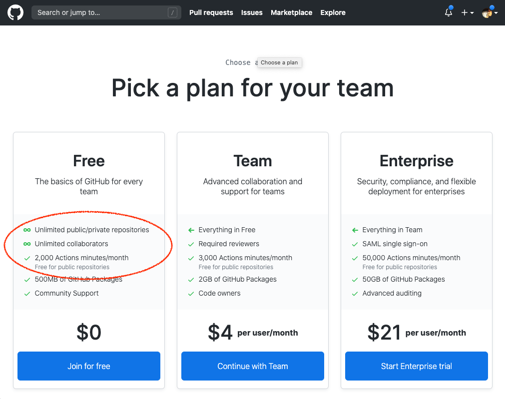
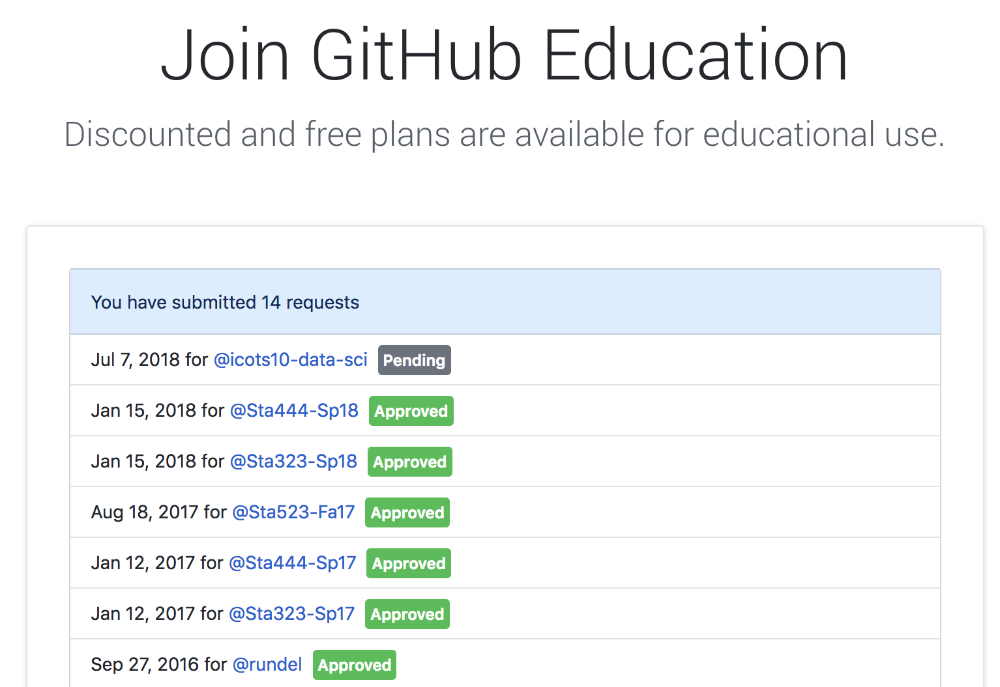
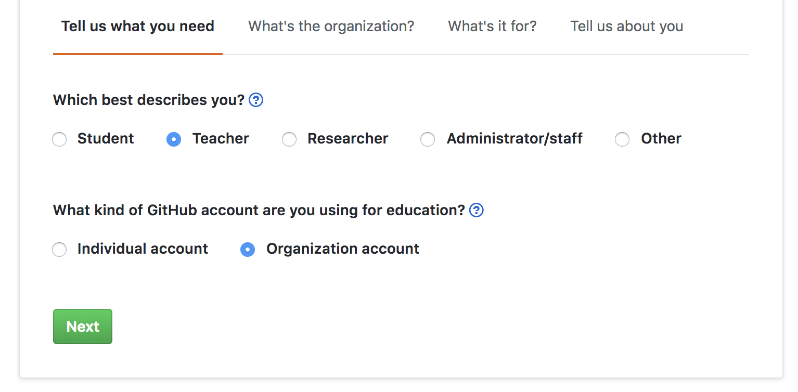
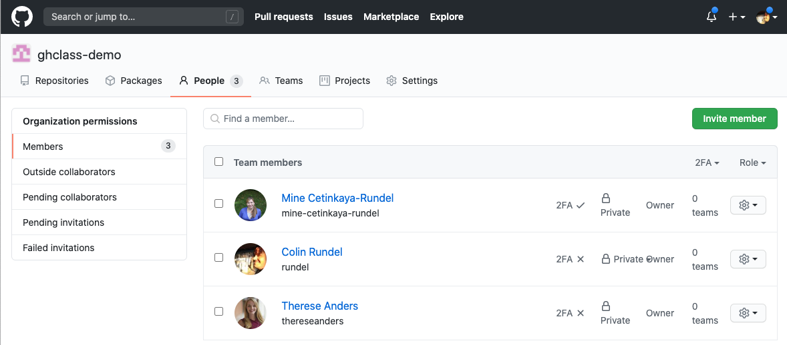
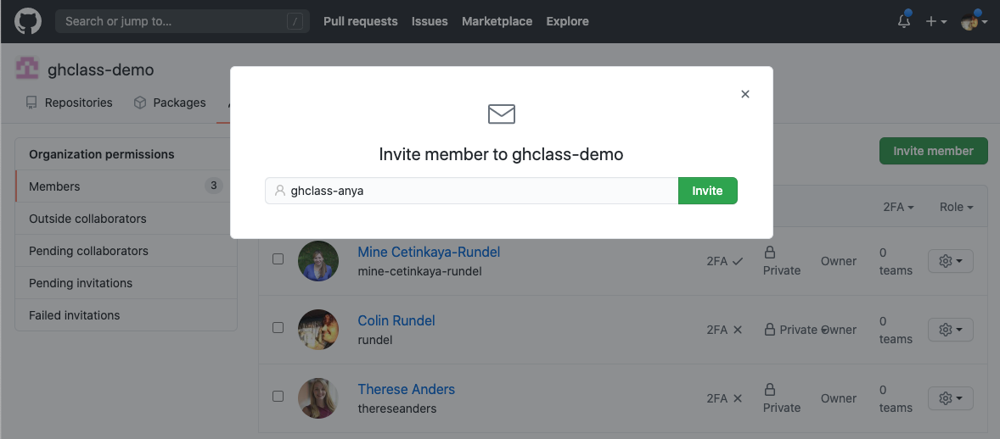
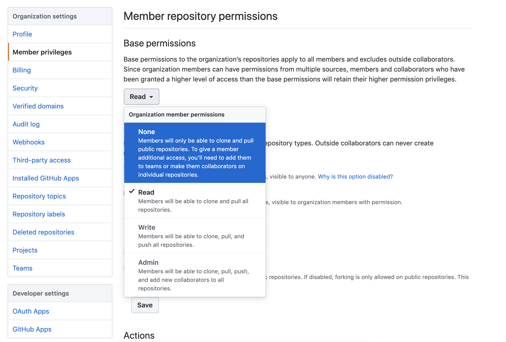
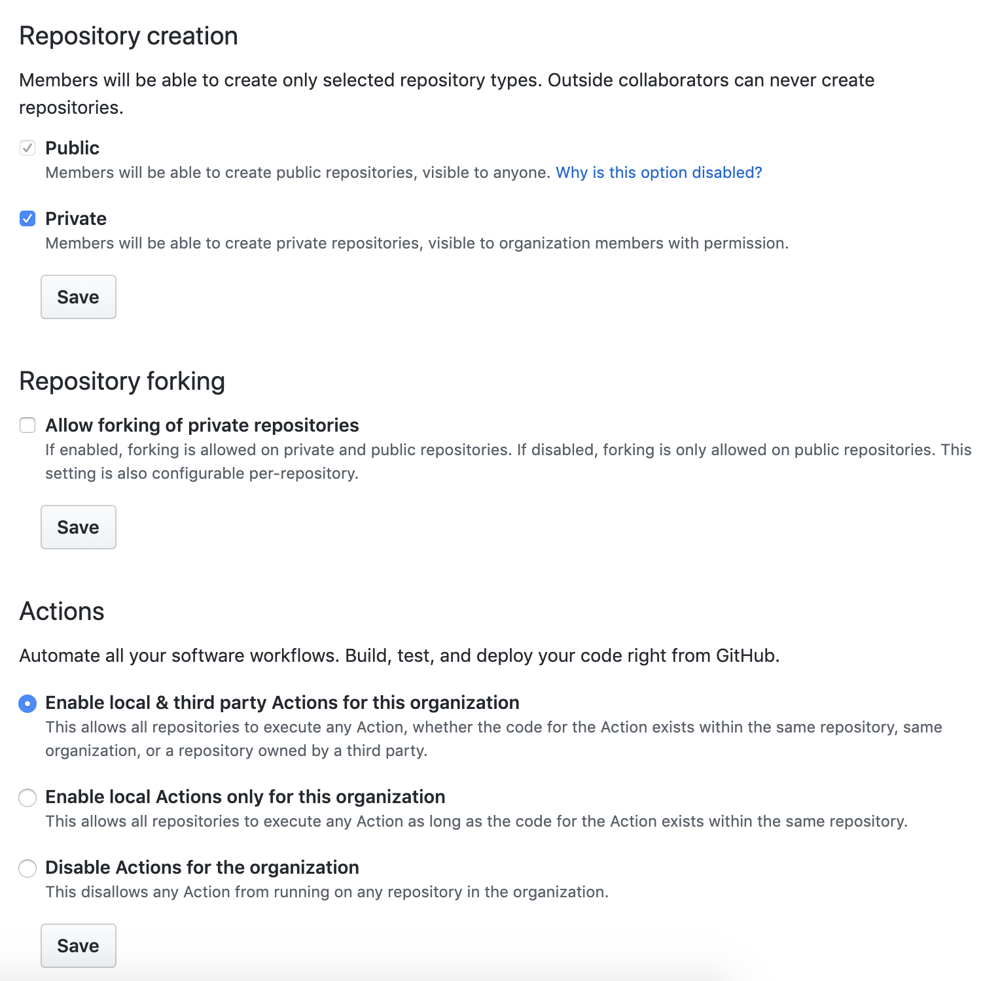
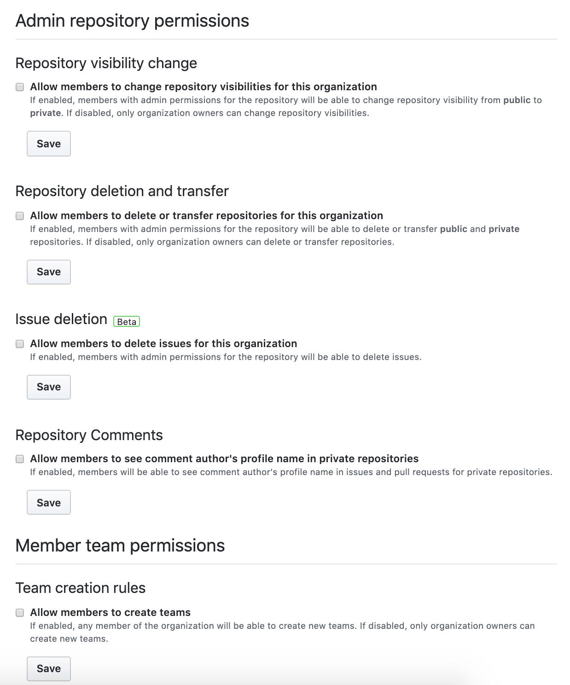
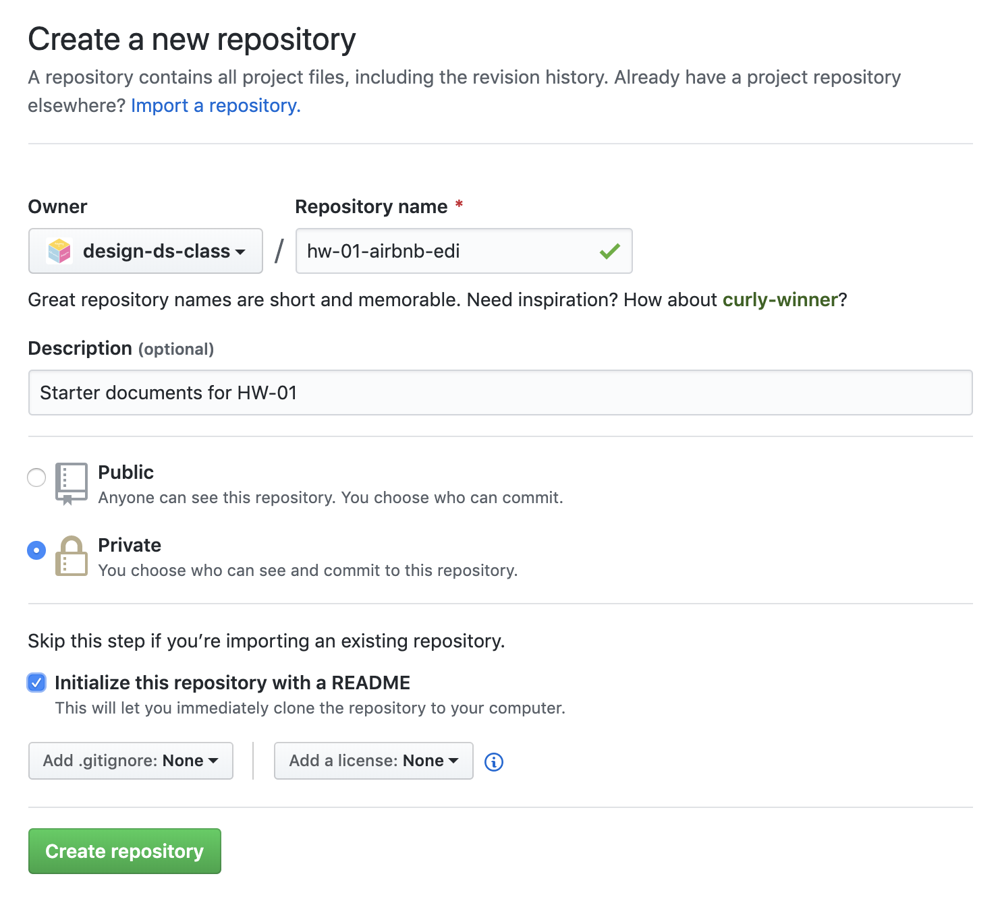
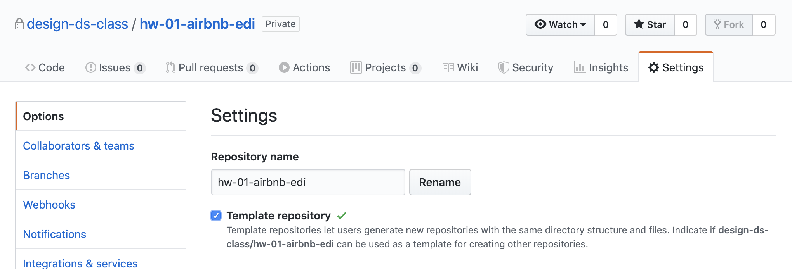

```{r child = "../setup.Rmd"}
```

```{r set-theme, include=FALSE}
library(xaringanthemer)
style_duo_accent(
  primary_color      = "#F5B895", # pantone peach quartz
  secondary_color    = "#A58D7F", # pantone stucco
  header_font_google = google_font("Raleway"),
  text_font_google   = google_font("Raleway", "300", "300i"),
  code_font_google   = google_font("Source Code Pro"),
  text_font_size     = "30px"
)
```


```{r load-packages, message=FALSE, echo=FALSE}
library(tidyverse)
```

## Activity 

**to do: needs to be updated**

.hand[while we wait to get started...]

- Go to [gallery.shinyapps.io/lego-sales](https://gallery.shinyapps.io/lego-sales/)
- Start working through the tutorial
- Feel free to make mistakes and test out the feedback
- If you get to the very end, follow the instructions (but if they seem a bit opaque, don't fret, we'll say more about "submission" later...)

---

.huge-text[you...]

.large[
- know and teach R
- are familiar with Git and GitHub
- are interested in teaching version control
- are interested in using GitHub as your learning management system
- might be interested in automation tools offered by GitHub for auto feedback
]

---

class: middle, inverse

.pull-left[
  .huge-text[why]
]
.pull-right[
  .larger[
  git &    
  github
  ]
]

---

- **Version control:** Lots of mistakes along the way, need ability to revert
- **Collaboration:** Platform that removes barriers to well documented collaboration
- **Accountability:** Transparent commit history
- **Early introduction:** 
  - Mastery takes time, earlier start the better
  - Marketability

---

## Goals for version control with Git / GitHub

- Centralize the distribution and collection of all student assignments

- Enable students to work collaboratively

- Force students to use git & GitHub
  - Version control is a best practice for reproducible research
  - Widely used in industry 
  - Publish / share work
  
---

class: middle, inverse

.huge-text[github]  
.larger[as your LMS]

---

## Basic Structure

On Github

- 1 Organization / class

- 1 repo / (student or team) / assignment

- Student and team repos all private by default

---

## Setting up a course

1. Create course organization on GitHub (https://github.com/organizations/new)
1. Request education discount for organization (https://education.github.com/discount)
1. Invite students to organization
1. Create assignment(s)
1. Collect assignments(s)
1. Grade assignment(s)

---

## Create course organization

```{r echo=FALSE}

```

---

## Request education discount

<br>

.pull-left[
```{r echo=FALSE}

```
]
.pull-right[
```{r echo=FALSE}

```
]

---

## Required information

When requesting the discount you will need to provide the following:

- A brief description of the purpose for the GitHub organization and how you plan to use GitHub

- Establishing connection to an academic institution by verifying with an `.edu` email + photo of your school id.

- Link to relevant website for the class / workshop / research group

- Verification is manual and can take between a couple hours to a couple days.

---

## Invite students

<br>

.pull-left[
```{r echo=FALSE}

```
]
.pull-right[
```{r echo=FALSE}

```
]

---

## Member Privileges

```{r echo=FALSE}

```

---

## Member Privileges (cont.)

```{r echo=FALSE}

```

---

## Member Privileges (cont.)

```{r echo=FALSE}

```

---

class: middle

.hand[ at this point, doing things on the GitHub UI starts to get quite tedious... ]

---

class: middle, inverse

.huge-text[`r emo::ji("parcel")` ghclass]

---

## `r emo::ji("parcel")` ghclass

### Tools for managing github class organization accounts

- Made for instructors who use GitHub for class management, e.g. students submit assignments via GitHub repos
- The package assumes that you’re an R user, and you probably teach R as well, though that’s not a requirement since this package is all about setting up repositories with the right permissions, not what your students put in those repositories.
- The package is still under active development and is not currently on CRAN but can be installed from GitHub using:

```{r eval=FALSE}
devtools::install_github("rundel/ghclass")
```

```{r}
library(ghclass)
```

---

## Collect data from students

- You really only need GitHub usernames
- Recommend also collecting emails though, as students might make a typo in their GitHub username

---

## Prior to collecting data...

You need to instruct students to create GitHub accounts

- Consider data privacy rules of institution / country (e.g. you may need to enter a data protection agreement for GDPR compliance)
- Give some guidance for selecting usernames (my favorite is on Happy Git with R: [happygitwithr.com/github-acct.html](https://happygitwithr.com/github-acct.html))

---

## Aside - GitHub tokens

`ghclass` uses the GitHub API to interact with your course organization and repos - the API verifies your identity using a personal access token which must be created and saved in such a way that `ghclass` can find and use it.

- Create token at  [github.com/settings/tokens](https://github.com/settings/tokens) 
- Once created, save token to `~/.github/token` or assign to the `GITHUB_TOKEN` as an environmentval variable
  - `usethis::edit_r_environ()`
  - `GITHUB_PAT="alphanumeric string of your GitHub token"`
  - Save, close, restart R for changes to take effect

---

## Checking tokens

- If the token is found and works correctly the following code should run without error

```{r}
github_test_token()
```

- If instead the token is invalid or not found, you will see something like the following

```{r error=TRUE, message=FALSE}
github_test_token("MADE_UP_TOKEN")
```

---

class: middle

# Inviting students

---

## Invite students

- This will generate an email to students.
- Instruct students to check their email and follow the instructions.

```{r}
org <- "design-ds-class"
```

```{r eval=FALSE}
roster <- read_csv("SURVEY RESPONSES.csv")

org_invite(org = org, user = roster$username)
```

```
## ✔ Invited user 'minebotmine' to org 'design-ds-class'.
## ✔ Invited user 'rundel' to org 'design-ds-class'.
```

---

## Check member status

- Who is already in?

```{r}
org_members(org)
```

- Who still didn't accept their invitations?

```{r}
org_pending(org)
```

---

class: middle

# Creating assignments

---

## Creating assignments - big picture

- Create a starter repo, keep it private
- Clone the repo and add any starter files (template Rmd, data, instructions, etc.)
- Commit and push your changes to the repo
- Use the `org_create_assignment()` function to create copies of the starter repo with correct permissions for each of your students (or teams)

---

## Creating your starter repo

<br>

```{r echo=FALSE}

```

---

## Make your starter repo a template

<br>

```{r echo=FALSE}

```

---

## Prepare your starter repo

- Clone it locally
- Add any necessary files
- Commit and push

<br>

[DEMO]

---

## Create assignments

```{r eval=FALSE}
org_create_assignment(
  org = org,
  repo = paste0("hw-01-airbnb-edi-", roster$username),
  user = roster$username,
  source_repo = paste0(org, "/hw-01-airbnb-edi")
)
```

<br>

[DEMO]

---

.your-turn[
- Go to the course organisation on GitHub: [github.com/design-ds-class](https://github.com/design-ds-class)
- Locate your HW 01 and read through the Getting started section and follow the instructions.
- Then, go through the Hello Git and Warm up sections as well.
- Finally, add your answer to Question 1, and commit and push again.
]

- If there is no GitHub repo created for you for this assignment, let me know.
- Clone using the HTTPS link, and let me know if   
you have 2-factor authentication enabled on  
GitHub (this complicates things!)

```{r echo=FALSE}
countdown(minutes = 10)
```


---

## Options for giving feedback on GitHub

- Use the GitHub UI to add issues to each student's repo

- Clone student repos locally and reproduce their work prior to giving feedback by adding issues on the GitHub UI

```{r eval=FALSE}
hw01_repos <- org_repos(org, "hw-01-airbnb-edi-")
local_repo_clone(hw01_repos, 
                 local_path = "hw01_submissions")
```

- Use the `issue_create()` function to post issues to all repos at once
  - Add a column for the repo name in `org/repo` format to roster
  - Add a column for feedback
  - [DEMO]
             
---

## Get big picture stats for an assignment

```{r eval=FALSE}
org_repo_stats(org, filter = "hw-01-airbnb-edi-")
```

<br>

[DEMO]

---

## Create team assignments

First, we'll make up some teams

```{r eval=FALSE}
org_create_assignment(
  org = org,
  repo = paste0("lab-03-nobel-laureates-", roster$team_name),
  user = roster$github_name,
  team = roster$team_name,
  source_repo = paste0(org, "/lab-03-nobel-laureates")
)
```

<br>

[DEMO]

---

.your-turn[
- Go to the course organisation on GitHub: [github.com/design-ds-class](https://github.com/design-ds-class)
- Locate your Lab 03 and read through the Getting started section and follow the instructions with your team members.
]

```{r echo=FALSE}
countdown(minutes = 10)
```

---

class: middle, inverse

# Giving feedback

---

## More on giving feedback in issues

- Instructors (and TAs) can view all repositories within the course organization.
- Use specific line references. [DEMO]
- Make sure to `@` mention the student so that they are notified when an issue is opened.
- You might want to consider keeping points out of issues.

---

## Peer review

- Once an assignment is completed you can let other students/teams into a repository and they can provide peer review.

- Peer review is an incredibly effective learning experience for both the reviewers and the reviewees, however it does require coordination and being able to carve out sufficient time in the course schedule.

- Tip: Do not solely count on peer review for feedback as some reviewers might be less diligent than others. Teams reviewing teams, as opposed to individual reviewing individuals, might address this issue partially.

See the [Peer review with ghclass vignette](https://rundel.github.io/ghclass/articles/peer.html) for more.

---

## Pull requests

- Another option is to open pull requests for your students' work where you directly edit their work and ask them to approve the edits.

- This can be effective as students will see your corrections and review them before accepting them.

- However this also does mean that you're directly correcting their work as opposed to giving them higher level instructions on how to correct it.

More on this in the next module...

---

.your-turn[
**Now you're the instructor:**

- First, I'll change everyone's permission level and make you *Owner*s. (Please don't delete any repos!)
- Go to the GitHub organization for our "class" and observe that now you can see all repos.
- Go into the individual repo (HW 01) for your neighbor. Open an issue and add some text to the issue. In the issue `@` mention their username. Submit your issue.

**Now you're a student:**
Check your email to confirm that you got notified of an issue being filed by your neighbor  
in your repo, and review the issue.
]

```{r echo=FALSE}
countdown(minutes = 10)
```

---

## Git + GitHub lessons learned

- If you plan on using git in class, start on day one, don’t wait until the “right time”
- First assignment should be individual, not team based to avoid merge conflicts
- Students need to remember to pull before starting work
- Impossible (?) to avoid shell intervention every once in a while
- Remind students on that future projects should go on GitHub with PI approval

---

.hand-large[thank you!]

All materials at [bit.ly/teach-r-online-mats](https://bit.ly/teach-r-online-mats)
