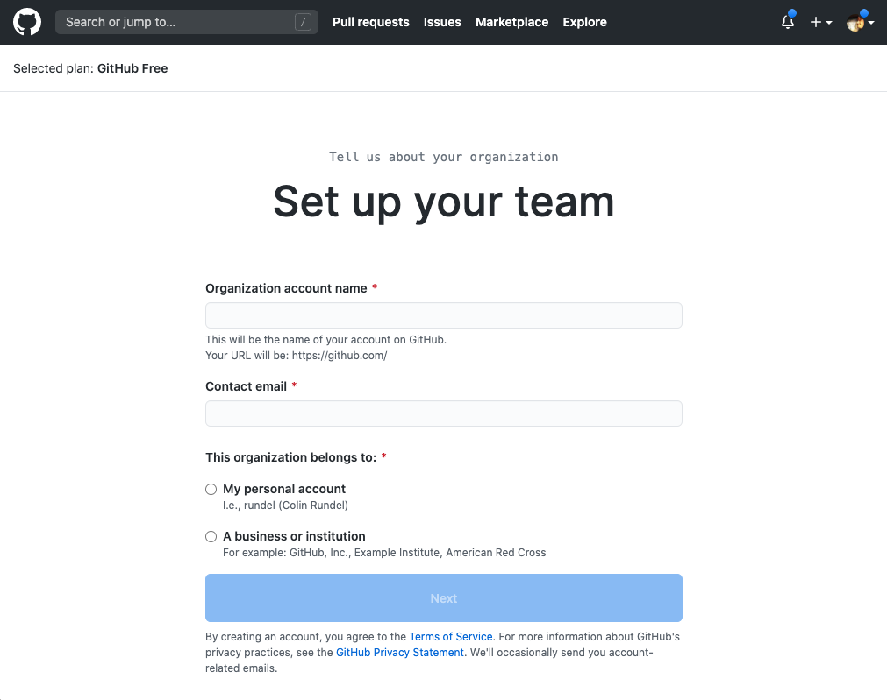
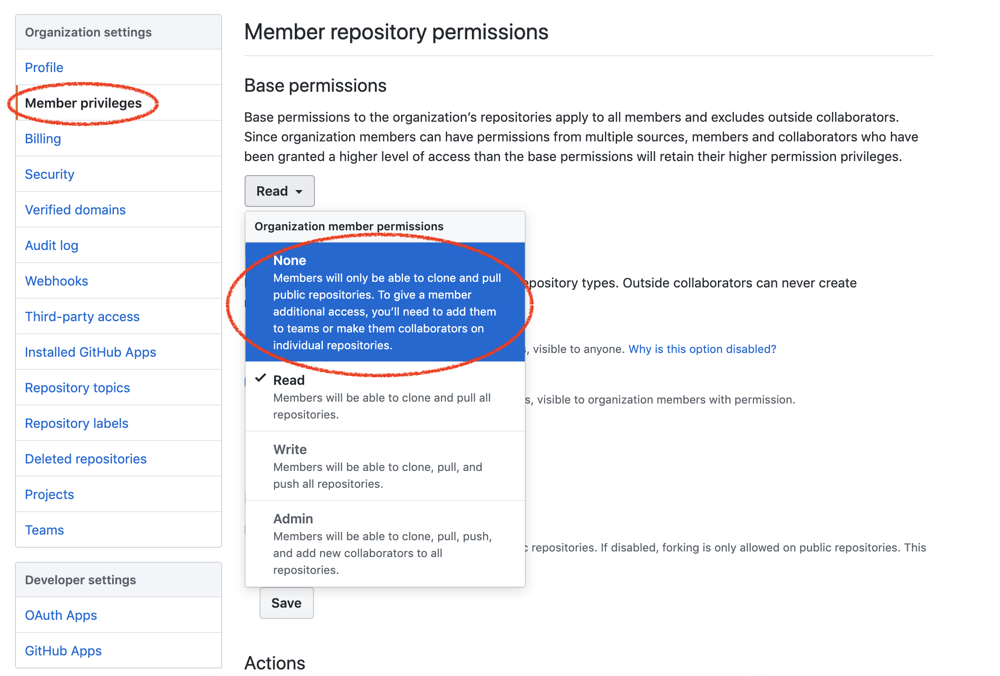
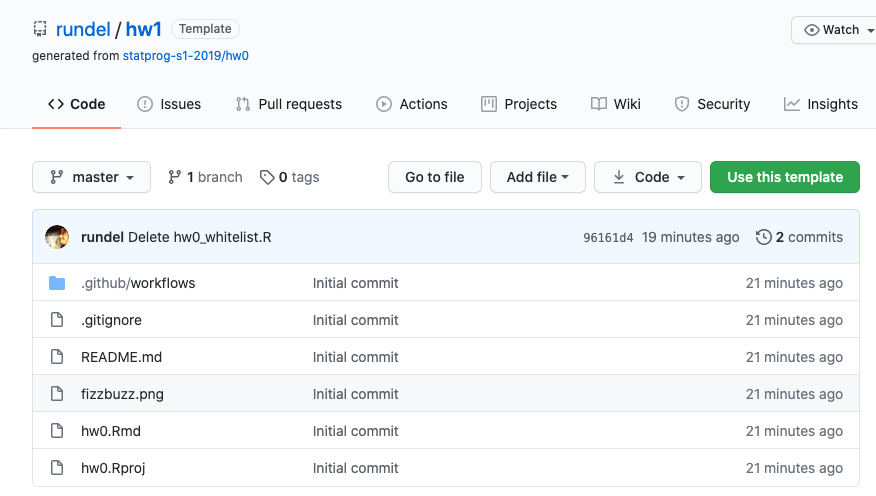
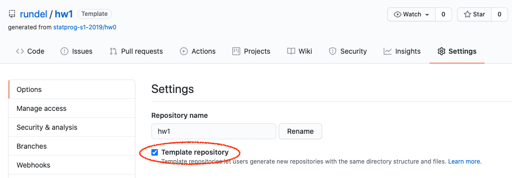

```{r child = "../setup.Rmd"}
```

```{r set-theme, include=FALSE}
library(xaringanthemer)
style_duo_accent(
  primary_color      = "#F5B895", # pantone peach quartz
  secondary_color    = "#A58D7F", # pantone stucco
  header_font_google = google_font("Raleway"),
  text_font_google   = google_font("Raleway", "300", "300i"),
  code_font_google   = google_font("Source Code Pro"),
  text_font_size     = "30px"
)
```


## Activity 

**to do: needs to be updated**

.hand[while we wait to get started...]

- Go to [bit.ly/gh-username](https://bit.ly/gh-username)
- Enter your GitHub username

---

.huge-text[you...]

.large[
- are familiar with R
- are familiar with git and GitHub
- are interested in teaching version control
- are interested in using GitHub as your learning management system
- might be interested in automation tools offered by GitHub for auto feedback
]

---

class: middle, inverse

.pull-left[
  .huge-text[why]
]
.pull-right[
  .larger[
  git &    
  github
  ]
]

---

## Goals for version control with Git / GitHub

- Centralize the distribution and collection of all student assignments

- Enable students to work collaboratively

- Force students to use (learn) git & GitHub
  - Version control is a best practice for reproducible research
  - Widely used in industry 
  - Publish / share work

---

class: middle, inverse

.huge-text[github]  
.larger[as a student]


---
class: middle

.center[
<iframe width="900" height="500" src="https://www.youtube.com/embed/zaoSeyHARGM?rel=0" frameborder="0" allow="accelerometer; autoplay; encrypted-media; gyroscope; picture-in-picture" allowfullscreen></iframe>
]

---

class: middle

.center[
<iframe width="900" height="500" src="https://www.youtube-nocookie.com/embed/5wKdo2XJMeU?rel=0" frameborder="0" allow="accelerometer; autoplay; encrypted-media; gyroscope; picture-in-picture" allowfullscreen></iframe>
]


---

.your-turn[
*We recommend one person in each group share their screen and everyone work together to work through the document.*

- Accept the invitation, 

- Obtain the *https* git url from the GitHub repository

- Open RStudio Cloud and start a new project with this url

- Work through Task 0 in the README

<br/>

If you did not receive an invite you can make your own copy of the repo using the *Use this template* button here: https://github.com/rundel/hw1
]


```{r echo=FALSE}
countdown(minutes = 15)
```

---

class: middle, inverse

.huge-text[github]  
.larger[as an instructor]

---

## Basic Structure

On Github,

- 1 Organization / class

- 1 repo / (student or team) / assignment

- Student and team repos are all private by default

- Students are added as members

- Tutors / TAs are added as owners (admins)

---

## Basic Workflows

1. Create organization

1. Invite students

1. Create assignment(s)

1. Collect and grade assignments(s) 


---

## Create course organization

.center[
https://github.com/organizations/new
]

```{r echo=FALSE, fig.align="center", out.width="50%"}
knitr::include_graphics("img/org-create.png")
```

---

## Create course organization

```{r echo=FALSE, fig.align="center", out.width="60%"}

```


---

## Education discount

While no longer required, GitHub offers a number of education benefits which you can register for here: https://education.github.com/benefits.

Of particular note are:

- Free GitHub swag here
  - https://education.github.com/toolbox/offers#github_swag

- Free Team plans for academic organizations and Pro plan for educators
  - https://education.github.com/toolbox/offers#github

---

## Org Setup

```{r echo=FALSE, fig.align="center", out.width="90%"}
knitr::include_graphics("img/org-people.png")
```

---

## Member Privileges

```{r echo=FALSE}

```

---

## Invite students

```{r echo=FALSE, fig.align="center", out.width="90%"}
knitr::include_graphics("img/org-invite.png")
```

--

.center[ .large[
.hand[ x 150 students ... ]
] ]

---

class: middle

.hand[ at this scale, doing anything with the GitHub UI starts to get quite tedious... ]

---

class: middle, inverse

.huge-text[`r emo::ji("parcel")` ghclass]

---

## `r emo::ji("parcel")` ghclass

- Design to automate interactions with GitHub (via its API) for class management

- The package is ~4 years old and still under active development

- Detailed introduction and documentation available on the package website: http://rundel.github.io/ghclass

- The package is not on CRAN (but will be imminently), for now it can be installed from GitHub using:

```{r eval=FALSE}
devtools::install_github("rundel/ghclass")
library(ghclass)
```

---

## `r emo::ji("parcel")` design

Some design principals behind the package:

1. All functions are prefixed to indicate what they operate on (e.g.  `org`, `repo`, `team`, `local_repo`, etc.)

2. Most functions are vectorized over their parameters, allowing related operations to be grouped

3. Most actions are non-destructive or backed by git, the handful of dangerous operations will warn you


---

## Aside - GitHub tokens

`ghclass` uses the GitHub API to interact with your organization and repos - the API verifies your identity using a personal access token which must be created and saved in such a way that `ghclass` can find and use it.

- Create a token at [github.com/settings/tokens](https://github.com/settings/tokens) 

- Once created, assign it to the `GITHUB_TOKEN` as an environmental variable in R by,
  
  - Run `usethis::edit_r_environ()`
  
  - Add `GITHUB_PAT="alphanumeric string of your GitHub token"` to the opened `.Renviron` file.
  
  - Save, close, restart R for changes to take effect

---

## Checking tokens

If the token is found and works correctly the following code should run without error

```r
github_test_token()
```

```
## ✓ Your GitHub PAT authenticated correctly.
```

If instead the token is invalid or not found, you will see something like the following

```r
github_test_token("BAD_TOKEN")
```

```
## x Your GitHub PAT failed to authenticate.
## └─GitHub API error (401): 401 Unauthorized
##   ├─ API message: Bad credentials
##   └─ API docs: https://developer.github.com/v3
```

---

## Invite students

- Collect student account names (and an email or other identifier)

```r
students = c("ghclass-anya", "ghclass-bruno", "ghclass-celine", "ghclass-diego")
org_invite(org = "ghclass-demo", user = students)
```

```
## ✓ Invited user 'ghclass-anya' to org 'ghclass-demo'.
## ✓ Invited user 'ghclass-bruno' to org 'ghclass-demo'.
## ✓ Invited user 'ghclass-celine' to org 'ghclass-demo'.
## ✓ Invited user 'ghclass-diego' to org 'ghclass-demo'.
```

---

## Rate limits

From GitHub's API docs,

> To prevent abuse, an authenticated user is limited to 50 organization invitations per 24 hour period. If the organization is more than one month old or on a paid plan, the limit is 500 invitations per 24 hour period.


---

## Check member status

Who is already in?

```r
org_members(org = "ghclass-demo")
```

```
## [1] "mine-cetinkaya-rundel" "rundel" "thereseanders"
```

<br/>

Who has not accepted their invitation?

```r
org_pending(org = "ghclass-demo")
```

```
## [1] "ghclass-anya"   "ghclass-bruno"  "ghclass-diego"  "ghclass-celine"
```

---

class: middle

# Creating assignments

---

## Starter repo

All assignments are just repositories on GitHub

- each is made up of a collection of files necessary for that assignment (e.g. README, templated Rmd, Rproj file, etc.)

- repos can be public or private and belong to any org

```{r echo=FALSE, fig.align="center", out.width="50%"}

```

---

## Template Repos

```{r echo=FALSE, fig.align="center", out.width="70%"}

```

```r
repo_set_template("rundel/hw1")
```

```
## ✓ Changed the template status of repo 'rundel/hw1' to TRUE.
```

```r
repo_is_template("rundel/hw1")
```

```
TRUE
```


---

## Create assignments

```r
org_create_assignment(
  org = "ghclass-demo",
  repo = paste0("hw01-", students),
  user = students,
  source_repo = "rundel/hw1"
)
```

```
## ✓ Mirrored repo 'rundel/hw1' to repo 'ghclass-demo/hw01-ghclass-anya'.
## ✓ Mirrored repo 'rundel/hw1' to repo 'ghclass-demo/hw01-ghclass-bruno'.
## ✓ Mirrored repo 'rundel/hw1' to repo 'ghclass-demo/hw01-ghclass-celine'.
## ✓ Mirrored repo 'rundel/hw1' to repo 'ghclass-demo/hw01-ghclass-diego'.
## ✓ Added user 'ghclass-anya' to repo 'ghclass-demo/hw01-ghclass-anya'.
## ✓ Added user 'ghclass-bruno' to repo 'ghclass-demo/hw01-ghclass-bruno'.
## ✓ Added user 'ghclass-celine' to repo 'ghclass-demo/hw01-ghclass-celine'.
## ✓ Added user 'ghclass-diego' to repo 'ghclass-demo/hw01-ghclass-diego'.
```

---

## Create team assignments

```r
students = c("ghclass-anya", "ghclass-bruno", "ghclass-celine", "ghclass-diego")
teams = c("team01", "team01", "team02", "team02")

org_create_assignment(
  org = "ghclass-demo",
* repo = paste0("hw01-", {{teams}}),
* team = teams,
  user = students,
  source_repo = "rundel/hw1"
)
```

```
## ✓ Mirrored repo 'rundel/hw1' to repo 'ghclass-demo/hw01-ghclass-anya'.
## ✓ Mirrored repo 'rundel/hw1' to repo 'ghclass-demo/hw01-ghclass-bruno'.
## ✓ Mirrored repo 'rundel/hw1' to repo 'ghclass-demo/hw01-ghclass-celine'.
## ✓ Mirrored repo 'rundel/hw1' to repo 'ghclass-demo/hw01-ghclass-diego'.
## ✓ Added user 'ghclass-anya' to repo 'ghclass-demo/hw01-ghclass-anya'.
## ✓ Added user 'ghclass-bruno' to repo 'ghclass-demo/hw01-ghclass-bruno'.
## ✓ Added user 'ghclass-celine' to repo 'ghclass-demo/hw01-ghclass-celine'.
## ✓ Added user 'ghclass-diego' to repo 'ghclass-demo/hw01-ghclass-diego'.
```

---

## Fixing mistakes

```r
repo_modify_file(
  repo = org_repos("ghclass-demo", filter = "hw01-"),
  path = "README.md",
  pattern = "Due 20/00/00 by 5:00 pm",
  content = "Due 2020/07/17 by 5:00 pm",
  method = "replace"
)
```

```
## ✓ Modified file 'ghclass-demo/hw01-ghclass-anya/README.md'.
## ✓ Modified file 'ghclass-demo/hw01-ghclass-bruno/README.md'.
## ✓ Modified file 'ghclass-demo/hw01-ghclass-celine/README.md'.
## ✓ Modified file 'ghclass-demo/hw01-ghclass-diego/README.md'.
## ✓ Modified file 'ghclass-demo/hw01-team01/README.md'.
## ✓ Modified file 'ghclass-demo/hw01-team02/README.md'.
```

---

```r
repo_get_readme("ghclass-demo/hw01-team01", include_details = FALSE) %>% 
  substr(1, 80) %>%
  cat()
```

```
## 
## Statistical Programming - Homework 1
## -------------
## 
## Due 2020/07/17 by 5:00 pm.
```


---
class: middle

# Collecting and Grading

---

## Repo details

```r
org_repos("ghclass-demo")
```

```
## [1] "ghclass-demo/hw01-ghclass-anya"   "ghclass-demo/hw01-ghclass-bruno" 
## [3] "ghclass-demo/hw01-ghclass-celine" "ghclass-demo/hw01-ghclass-diego" 
## [5] "ghclass-demo/hw01-team01"         "ghclass-demo/hw01-team02" 
```

```r
org_repos("ghclass-demo", filter = "hw01-team")
```

```
## [1] "ghclass-demo/hw01-team01" "ghclass-demo/hw01-team02"
```

---


```r
org_repo_stats("ghclass-demo", inc_prs)
```

```
## # A tibble: 6 x 6
##   repo                             private commits last_update         open_issues closed_issues
##   <chr>                            <lgl>     <int> <dttm>                    <int>         <int>
## 1 ghclass-demo/hw01-team02         TRUE          2 2020-07-17 08:42:50           0             0
## 2 ghclass-demo/hw01-team01         TRUE          2 2020-07-17 08:42:48           0             0
## 3 ghclass-demo/hw01-ghclass-diego  TRUE          2 2020-07-17 08:42:47           0             0
## 4 ghclass-demo/hw01-ghclass-anya   TRUE          2 2020-07-17 08:42:41           0             0
## 5 ghclass-demo/hw01-ghclass-bruno  TRUE          2 2020-07-17 08:42:43           0             0
## 6 ghclass-demo/hw01-ghclass-celine TRUE          2 2020-07-17 08:42:45           0             0
```

---

## Collecting

```r
local_repo_clone(org_repos("ghclass-demo", filter = "hw01-team"), local_path = "hw1/")
```

```
✓ Cloned 'ghclass-demo/hw01-team01'.
✓ Cloned 'ghclass-demo/hw01-team02'.
```

--

```r
fs::dir_tree("hw1/", recurse = TRUE)
```

```
hw1/
├── hw01-team01
│   ├── README.md
│   ├── hw1.Rmd
│   └── hw1.Rproj
└── hw01-team02
    ├── README.md
    ├── hw1.Rmd
    └── hw1.Rproj
```


---

## Options for giving feedback on GitHub

- Use the GitHub UI to review and add issues to each repo

- Use the `issue_create()` function to post issues to all repos at once

- Create pull requests with explicit revisions to student code 

- Clone repos locally and add feedback in a file, push back to GitHub

---

## More on giving feedback in issues

- Instructors (and TAs) can view all repositories within the course organization.

- Builtin tools for referencing specific commits, lines of code, etc.

- `@` mention students so that they are notified when an issue is opened.

- You may want to consider keeping grades / marks out of issues.

---

.your-turn[
- Pick one person from the team to be the "instructor" and share their screen.

- Go to https://github.com/ghclass-demo/hw01-everyone

- Go to the issues tab, open a new issue, and provide mock feedback. Tag someone from your team by using the `@` sign in front of their GitHub.

- Go to `hw1.Rmd`, pick a line of code, click on the `...` next to the numbers, click on *Reference in new issue*, and add a comment on the issue that links to this line of code.
]

```{r echo=FALSE}
countdown(minutes = 10)
```

---

## Peer review

- Once an assignment is completed you can let other students/teams into a repository and they can provide peer review.

- Peer review is an incredibly effective learning experience for both the reviewers and the reviewees, however it does require coordination and being able to carve out sufficient time in the course schedule.

- Tip: Do not solely count on peer review for feedback as some reviewers might be less diligent than others. Teams reviewing teams, as opposed to individual reviewing individuals, might address this issue partially.

- Functionality for coordinating this has been implemented in ghclass, will be available in the next version.


---

## Automated feedback

```r
action_workflows("ghclass-demo/hw01-team01")
```

```
## # A tibble: 1 x 4
##   name       path                      state  badge_url
##   <chr>      <chr>                     <chr>  <chr>
## 1 check_knit .github/workflows/knit.y… active https://github.com/ghclass-demo/hw01-team01/…
```


```r
action_add_badge(
  repo = org_repos("ghclass-demo", "hw01-")
)
```

```
## ✓ Modified file 'ghclass-demo/hw01-ghclass-anya/README.md'.
## ✓ Modified file 'ghclass-demo/hw01-ghclass-bruno/README.md'.
## ✓ Modified file 'ghclass-demo/hw01-ghclass-celine/README.md'.
## ✓ Modified file 'ghclass-demo/hw01-ghclass-diego/README.md'.
## ✓ Modified file 'ghclass-demo/hw01-team01/README.md'.
## ✓ Modified file 'ghclass-demo/hw01-team02/README.md'.
```


---

class: middle, inverse

.huge-text[closing]
.huge-text[thoughts]

---

## Git + GitHub lessons learned

- If you plan on using git in class, start on day one, don’t wait until the “right time”

- First assignment should be individual, not team based to avoid merge conflicts

- Remind students to remember to pull before starting work

- Unlikely you will avoid the necessity of shell intervention at some point

- Remind students on that future projects should go on GitHub with PI approval

---

.large[
.hand[Q: What about data protection regulations (FERPA, GDPR)?]
]

- Consider data privacy rules of institution / country (e.g. you may need to enter a data protection agreement for GDPR compliance)

- Make everything private by default (ghclass opts for this)
  - Private repos
  - Hidden team and org memberships
  - Disallow forking of private repos
  
---

.large[
.hand[Q: What about GitHub Classroom?]
]

This is education tool created by GitHub manage repository sharing and collection.

- It is great and very usable and they continue to improve it.

- ghclass and Classroom can work together, pick the workflow that is best for you.

---

.large[
.hand[Q: How do you introduce git and GitHub to students?]
]


Example materials for students,

- git and GitHub intro - https://introds.org/labs/lab-01/lab-01-hello-r
  
- merge conflict activity - https://introds.org/labs/lab-04/lab-04-ugly-charts.html#merge-conflicts


---

.hand-large[thank you!]

All materials at [bit.ly/teach-r-online-mats](https://bit.ly/teach-r-online-mats)


