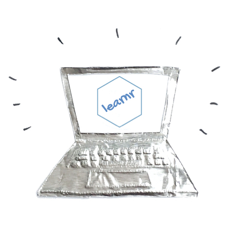

# Teaching Statistics and Data Science Online

## July 2020

The workshops are hosted by the Centre for Statistics at the University of Edinburgh. The workshops are free, but registration is required. Note that there is a separate registration for each session and the Zoom details will only be available to those who have registered. Workshops will be recorded for those who can't make it at the scheduled times. We're looking forward to seeing you there!

---

### Workshop 1: Teaching R online with RStudio Cloud
#### Friday July 3rd, 2 - 3:30pm BST

### Slides - [html](https://mine-cetinkaya-rundel.github.io/teach-r-online/01-cloud/01-cloud.html#1)  / [pdf](https://mine-cetinkaya-rundel.github.io/teach-r-online/01-cloud/01-cloud.pdf)

### [Activity](https://mine-cetinkaya-rundel.github.io/teach-r-online/01-cloud/01-cloud.html#2) while we wait to get started...

RStudio Cloud is a lightweight and easy to set up / use solution to teaching R online, in the browser. In this webinar we will walk you through the steps of setting up your course on RStudio Cloud, highlighting the various functionalities for teachers and students. We will also discuss best practices and provide opportunities for interacting with RStudio Cloud from the student and the instructor perspectives.  
**Registration:** [smartsurvey.co.uk/s/JLORPJ](https://www.smartsurvey.co.uk/s/JLORPJ/)

---

### Workshop 2: Building interactive tutorials in R
#### Friday July 10th, 2 - 3:30pm BST

### Slides - [html](https://mine-cetinkaya-rundel.github.io/teach-r-online/02-tutorial/02-tutorial.html#1)  / [pdf](https://mine-cetinkaya-rundel.github.io/teach-r-online/02-tutorial/02-tutorial.pdf)

### [Activity](https://mine-cetinkaya-rundel.github.io/teach-r-online/02-tutorial/02-tutorial.html#2) while we wait to get started...

The learnr R package provides a new multimedia approach for teaching statistics and programming with R. Building on R Markdown, this package allows teachers to create interactive tutorials containing narrative, figures, illustrations, and equations, code exercises (R code chunks that users can edit and execute directly), multiple choice quiz questions, videos, and interactive Shiny components. Tutorials built with this tool can be used for checking and reinforcing students' understanding and have the benefit of being self-paced and provide instant feedback. We will demonstrate how to use the learnr package to build interactive R tutorials and discuss best practices for using them.  
**Registration:** [smartsurvey.co.uk/s/10FXRD](https://www.smartsurvey.co.uk/s/10FXRD/)

---

### Workshop 3: Teaching computing with Git and GitHub 
#### Friday July 17th, 2 - 3:30pm

### Slides [To be posted]

A version control system is an essential element of a reproducible workflow that deserves due consideration among the learning objectives of statistics courses. In this workshop we demonstrate how to teach data science and statistical computing with using Git (a version control system) and GitHub (a remote hosting service for Git repositories) as concrete learning objectives for the course. The goal of this workshop is to equip educators with concrete information on how to get started with teaching with Git as well as give them hands-on experience from the student and the instructor perspective.  
**Registration:** [smartsurvey.co.uk/s/G2KXHP](https://www.smartsurvey.co.uk/s/G2KXHP/)

---

Illustrations by Desirée De Leon.
